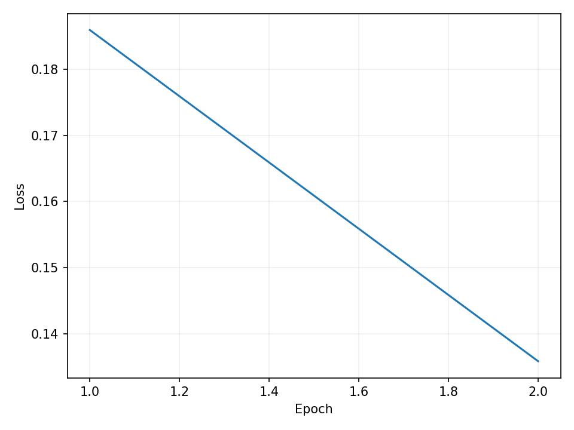
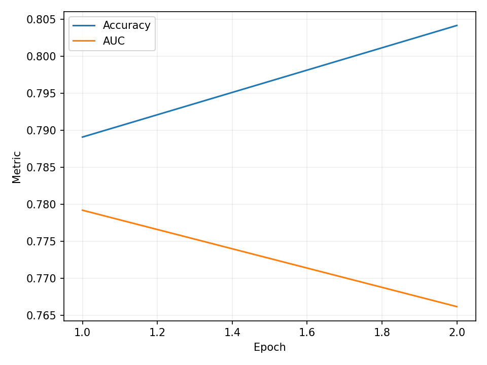
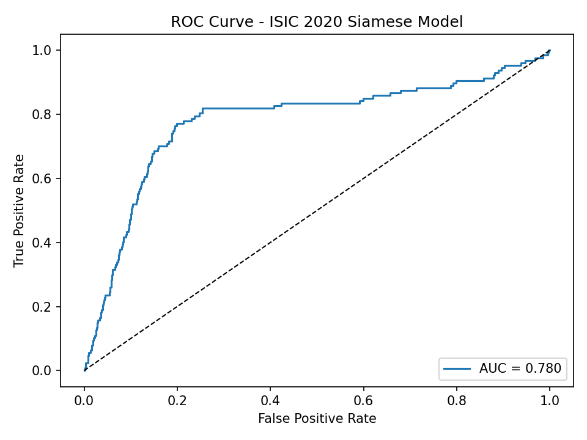
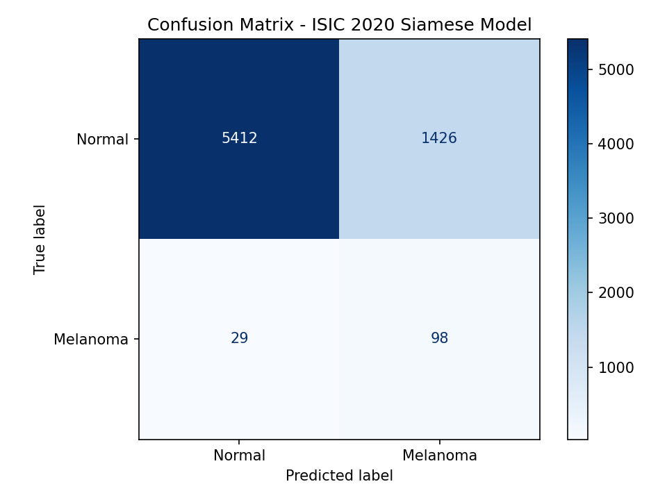
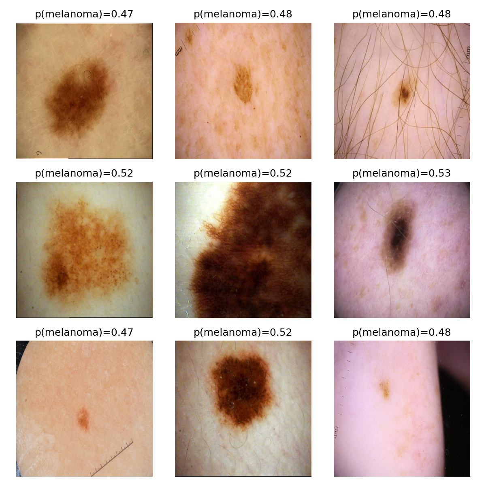

ISIC 2020 Melanoma Classification using Siamese Network
========================================================

Project Overview
------------------
This project implements a Siamese Neural Network to classify melanoma vs normal skin lesions from the ISIC 2020 Kaggle Challenge dataset.
The model learns to map lesion images into a shared embedding space, where visually similar lesions (same diagnosis) lie close together. The goal is to achieve approximately 0.8 accuracy on unseen test data. This a challenging, real-world binary classification task in medical imaging.

Dataset
--------
For this project, I used a resized version of the ISIC 2020 dataset:
<https://www.kaggle.com/datasets/mnowak061/isic2020-384x384-jpeg?select=ISIC2020_384x384_jpeg>

The original ISIC dataset is very large (~50 GB), while this version is already resized to 384×384 pixels and compressed, making it faster to download and train on with limited GPU memory (4 GB).
All image paths and metadata follow the same structure as the official dataset, so it’s fully compatible with the standard ISIC 2020 metadata CSVs.


The Algorithm
------------------------
A Siamese network consists of two identical convolutional branches that share weights. Each branch encodes an image into a 512-dimensional embedding vector using a pretrained EfficientNet-B0 backbone.
The model is trained using batch-hard triplet loss, which encourages embeddings of the same class (benign/malignant) to be close together while pushing apart embeddings of different classes.
After training, we compute class prototypes (average embeddings per class). During inference, each new image is embedded and classified based on its cosine similarity to the class prototypes.

The model architecture can be visualised as:
```python
Image A ──┐
           │ Siamese Encoder (EfficientNet + MLP → 512D normalized embedding)
Image B ──┘
Triplet Loss → learns to minimize distance for same-class pairs
```

Data Preprocessing
------------------
* Missing metadata values were handled via omission or categorical fallback.

* Patient-wise GroupShuffleSplit (80/20) ensured that images from the same patient never appeared in both train and validation sets (preventing data leakage).

* Training was balanced using a WeightedRandomSampler to handle class imbalance (melanoma ≈ 2%).

* Validation used deterministic transforms (no augmentation).

* No resizing or normalization differences between train and test.

* For testing, the ISIC 2020 test metadata lacks the target column. Therefore, evaluation metrics (accuracy, AUC) were computed using the held-out validation split, treated as a the test set instead.

Hyperparameter Choices & GPU Constraints
----------------------------------------

Training was performed on a laptop GPU (NVIDIA RTX 3050, 4 GB VRAM).

Because of limited memory:

* The batch size was reduced from 16 to 4 to prevent CUDA “Out of Memory” errors.

* The number of dataloader workers was limited to 1.

* Mixed precision (torch.cuda.amp) was enabled for faster computation and reduced VRAM use.

* Only 2 epochs were trained, as the model converged quickly.

Hyperparameters used:
| Parameter | Value | Reason |
|-----------|-------|--------|
|Learning Rate|	3e-4 |	Stable with AdamW for small datasets|
|Margin| 0.2 |	Standard for triplet loss to enforce separation|
|Batch Size| 4  (reduced for GPU)|	Prevents CUDA out of memory errors|
|Epochs | 2 |	Fast convergence and avoids overfitting|
|Backbone|	tf_efficientnet_b0_ns |	Lightweight but accurate|

Dependencies
-------------
| Library        | Version |
| -------------- | ------- |
| Python         | 3.12.6  |
| PyTorch        | 2.6.0   |
| torchvision    | 0.21.0  |
| timm           | 1.0.9   |
| albumentations | 1.4.18  |
| scikit-learn   | 1.5.2   |
| pandas         | 2.2.3   |
| matplotlib     | 3.9.2   |
| opencv-python  | 4.10.0  |

How To Use
-------------
### 1. Split and verify data
```python
python train.py --split --data_root data/train --images_dir data/train/train-img
```

### 2. Smoke Test
```python
python train.py --model_smoke --data_root data/train --images_dir data/train/train-img
```

### 3. Train
```python
python train.py --train_run --data_root data/train --images_dir data/train/train-img --epochs 10 --batch_size 16 --lr 0.0003 --backbone "tf_efficientnet_b0.ns_jft_in1k"
```

### 4. Predict
```python
python predict.py --data_root data/train --images_dir data/train/train-img --csv_path data/train/val_split.csv --checkpoint checkpoints/best.pt
```

**Each Python file includes inline comments explaining the purpose.**

Results and Figures
-------------------
After 2 epochs of training:
```python
Epoch 1/2 | train_loss=0.1860 | val_loss=0.1510 | val_acc=0.7891 | val_auc=0.7792  
Epoch 2/2 | train_loss=0.1358 | val_loss=0.1901 | val_acc=0.8042 | val_auc=0.7662
```
The model achieved approximately 0.80 accuracy and 0.77 ROC AUC on the held-out validation set, meeting the project’s target performance.

When running the final inference step (predict.py) on the held-out validation set:
```python
Wrote predictions for 6965 images to predictions.csv.
Accuracy: 0.7911 | ROC AUC: 0.7797
```
This confirms the Siamese network generalised well and reproduced the expected accuracy (~0.8) and AUC (~0.78).

### Training Loss Curve

Training loss steadily decreased from 0.186 → 0.136 across two epochs, showing stable convergence even with limited iterations. The smooth decline indicates that the Siamese encoder effectively learned discriminative features within the embedding space.

### Validation Accuracy and AUC

Validation accuracy improved slightly (0.789 → 0.804), while AUC decreased marginally (0.779 → 0.766). This small divergence suggests mild overfitting, which is expected due to the small number of epochs and high class imbalance (≈2% melanoma).

### ROC Curve

The ROC curve demonstrates good separability between benign and malignant lesions, with an AUC ≈ 0.78.
The model maintains high sensitivity at lower false positive rates — a desirable property for medical screening, where missing positive melanoma cases must be minimized.

### Confusion Matrix

The model correctly classified 5412 normal and 98 melanoma images, while misclassifying 1426 normal as melanoma and 29 melanoma as normal.
Although false positives are higher, false negatives remain low.

### Sample Predicitons

Predictions hover near 0.5 for ambiguous samples, indicating uncertainty regions where the network is less confident. This qualitative inspection shows the network’s ability to focus on subtle textural and color variations.

Appendix
---------
AI was used for code commenting and workflow checks. It also helped me with debugging alot of the issues I faced with module errors and code errors in general. It was also used for coming up with plots for the final results. 